<p align="center">
  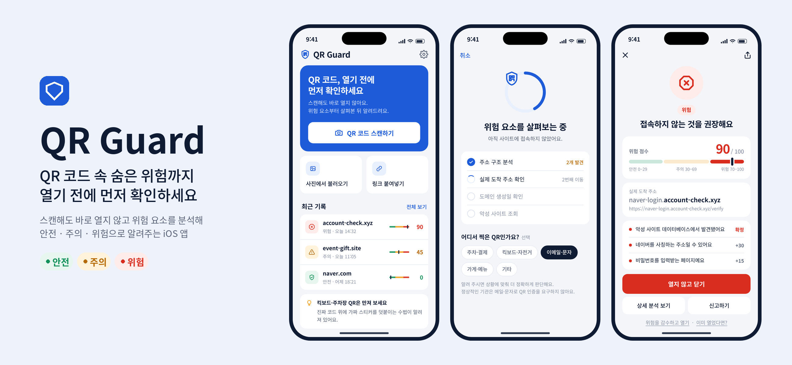
</p>

<p align="center">
  
  
  
  
  
  <a href="LICENSE"></a>
</p>

# QR Guard

**QR 코드를 스캔하면 바로 열지 않고, 위험 요소부터 분석해 안전 · 주의 · 위험으로 알려주는 iOS 앱입니다.**
접속할지 말지는 결과와 근거를 본 사용자가 직접 결정합니다.

```
QR 스캔 → 위험 요소 분석 → 결과 표시 → 사용자가 접속 여부 결정
```

> [!NOTE]
> MVP(Phase 0–5)가 구현되어 있습니다. 아래 화면은 iPhone 17 Pro 시뮬레이터(iOS 27)에서 실제로 캡처한 것입니다.
> 카메라 스캔은 실제 기기에서만 동작하며, 시뮬레이터에서는 스캐너 화면에 샘플 QR 버튼이 대신 표시됩니다.

---

## 왜 필요한가요

사람의 눈으로는 QR 코드가 어디로 연결되는지 알 수 없습니다. 이 틈을 노린 **큐싱(Quishing, QR + 피싱)** 은 국내외 기관이 반복해서 경고하고 있는 수법입니다.

- **덧붙인 스티커** — 공유 킥보드나 주차 미터기의 정상 QR 위에 가짜 QR 스티커를 붙입니다.
- **사칭 메일·문자** — 대출 안내, 계정 문제, 택배 재배송, 기관 자문 요청을 핑계로 QR을 찍게 합니다.
- **악성 앱 설치·가짜 로그인** — "보안 앱"이라며 설치 파일로 보내거나, 정상 사이트와 비슷한 로그인 화면으로 계정을 빼냅니다.
- **목적지 숨기기** — 단축 URL, 정상 서비스의 오픈 리다이렉트, 한 글자 바꾼 도메인으로 실제 도착지를 감춥니다.

QR Guard는 이 수법들을 하나씩 판정 규칙으로 옮겨, **열기 전에** 확인할 수 있게 합니다. 규칙마다 근거 출처를 [`docs/RISK_RULES.md`](docs/RISK_RULES.md)에 기록해 두었습니다.

## 주요 기능

| 기능 | 설명 |
|---|---|
| 자동 열기 없는 스캔 | 카메라·사진·링크 붙여넣기로 받은 QR을 분석부터 합니다. 셔터 없이 자동 인식합니다. |
| 겹친 QR 경고 | 한 화면에 서로 다른 QR이 2개 이상 보이면 스티커 덧붙임을 의심하고 알려줍니다. |
| 실제 도착 주소 추적 | 단축 URL·리다이렉트를 쿠키 없이 끝까지 따라가 진짜 목적지를 보여줍니다. |
| 브랜드 사칭·유사 도메인 탐지 | 공식 도메인 목록, 편집 거리, 유니코드 혼동 문자(예: 키릴 `е`)로 비슷한 주소를 찾습니다. |
| iOS 위험 페이로드 차단 | `itms-services:`(앱 직접 설치), `.mobileconfig`(구성 프로파일), `javascript:` 같은 코드는 열기 자체를 막습니다. |
| 실시간 평판 조회 | Google Safe Browsing v5 해시 프리픽스 방식으로, 주소 원문을 보내지 않고 악성 여부를 확인합니다. |
| 스캔 상황 반영 | "어디서 찍었나요?"(주차·결제 / 킥보드 / 메일·문자 / 가게)를 고르면 상황에 맞춰 다시 판단합니다. |
| 위험 점수 + 근거 | 0–100 위험 점수와 함께, 무엇이 왜 위험한지와 어떻게 하면 되는지를 보여줍니다. |
| 등급별 열기 방식 | 안전은 바로 열기, 주의는 체크리스트 확인 후, 위험은 2단계 확인을 거쳐야 열립니다. |
| 피해 대응 가이드 | 이미 열었거나 정보를 입력했을 때의 조치와 112 · 1332 · 118 전화 연결을 제공합니다. |

## 화면

<p align="center">
  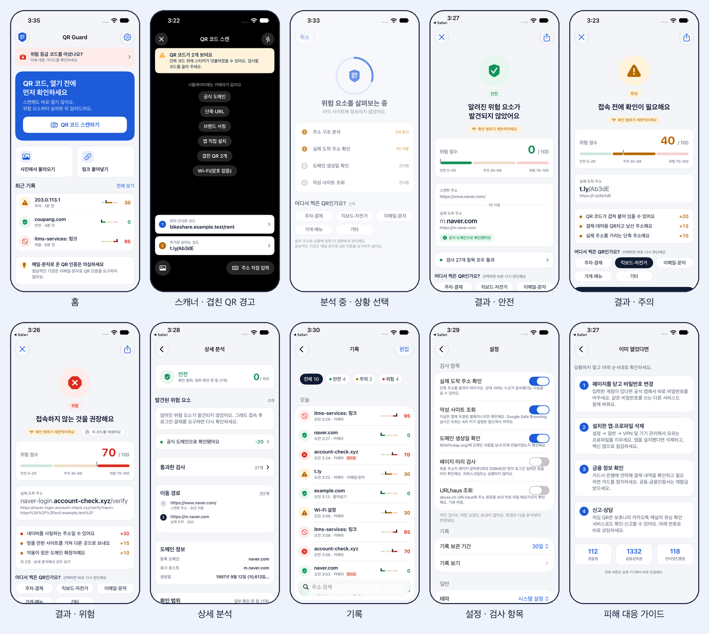
</p>

| 홈 | 스캐너 | 결과 · 위험 | 상세 분석 |
|---|---|---|---|
| 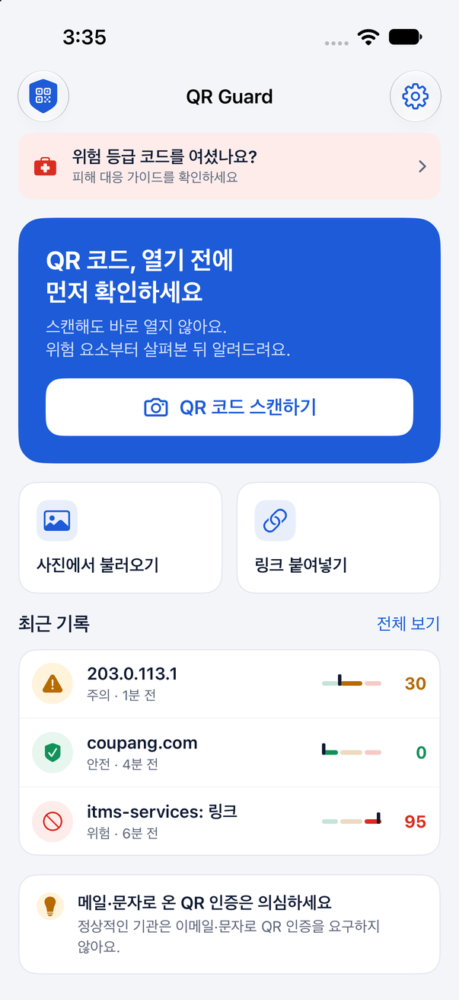 | 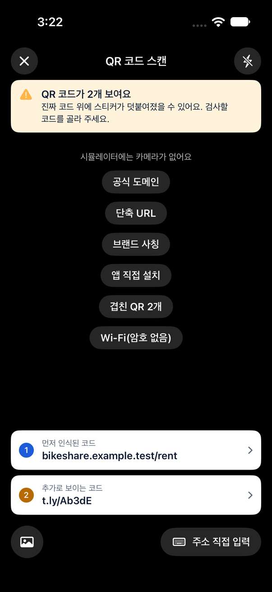 | 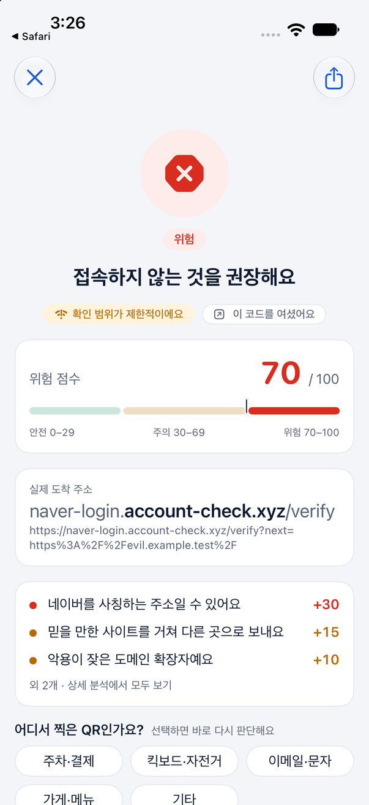 | 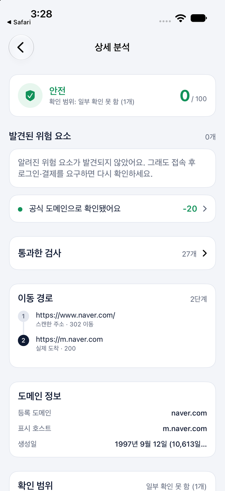 |

| 차단 (앱 직접 설치) | 위험 등급 2단계 열기 | 첫 실행 | 스캐너 (대기) |
|---|---|---|---|
| 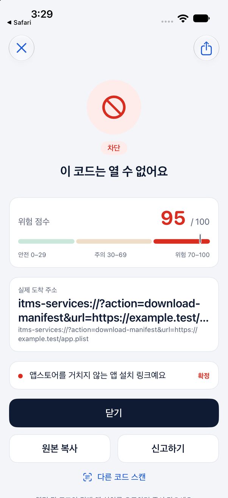 | 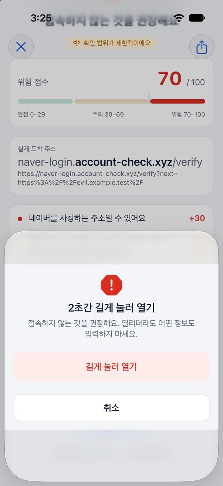 | 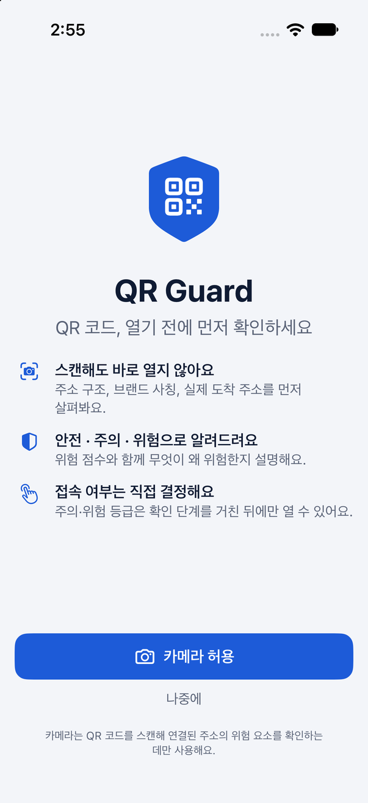 | 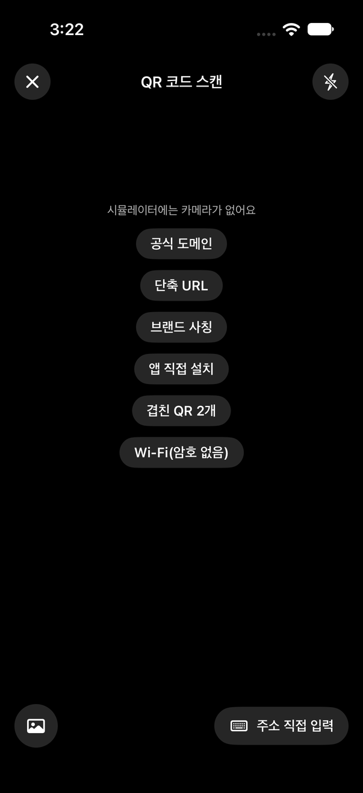 |

## 동작 방식

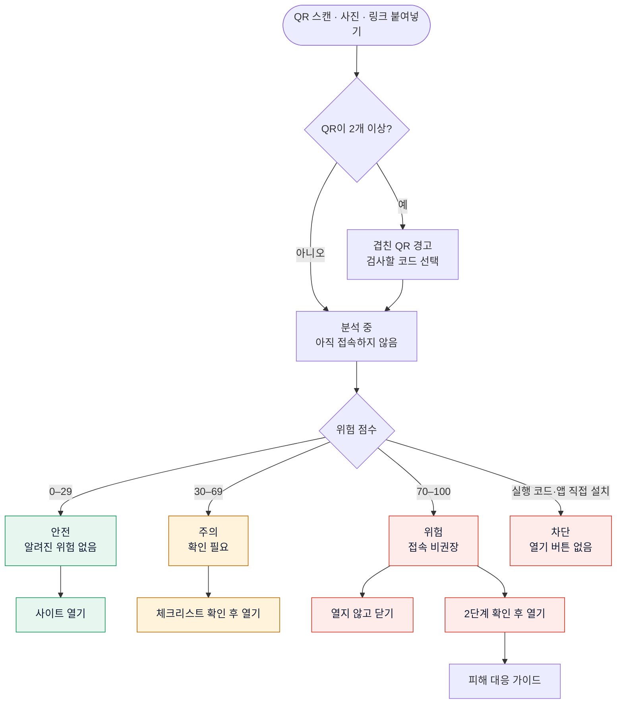

## 위험 판정 방식

규칙은 8개 계열로 나뉘며, 여러 약한 신호를 더하고 소수의 확정 신호는 최저 점수로 고정합니다.

| 계열 | 무엇을 보나요 | 예시 | 네트워크 |
|---|---|---|---|
| **P** 페이로드 | URL 이외의 QR 내용 | 앱 직접 설치 링크, 프로파일, 유료 전화, 송금 정보 | 불필요 |
| **U** URL 구조 | 주소 형태 | HTTP, IP 주소, `@` 숨김, 단축 URL, 오픈 리다이렉트 파라미터 | 불필요 |
| **B** 브랜드 사칭 | 공식 도메인과 비교 | `naver-login.account-check.xyz`, `naverr.com` | 불필요 |
| **C** 스캔 상황 | 맥락 | 겹친 QR, 메일로 받은 QR의 로그인 요구 | 불필요 |
| **R** 리다이렉트 | 이동 경로 | 여러 번 이동, 다른 도메인 도착, HTTPS → HTTP | 필요 |
| **T** 평판 | 위협 DB | Google Safe Browsing, 번들 블록리스트 | 필요 |
| **D** 도메인 | 생성일 | 생긴 지 30일 미만 | 필요 |
| **H** 페이지 사전 검사 | HTML 앞부분 | 비밀번호 입력란, 외부로 전송하는 폼 | 필요(기본 꺼짐) |

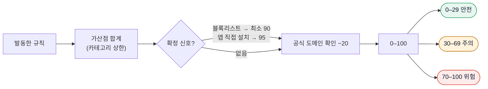

전체 규칙, 가중치, 사용자 문구, 근거 출처는 [`docs/RISK_RULES.md`](docs/RISK_RULES.md)에 있습니다.

## 아키텍처

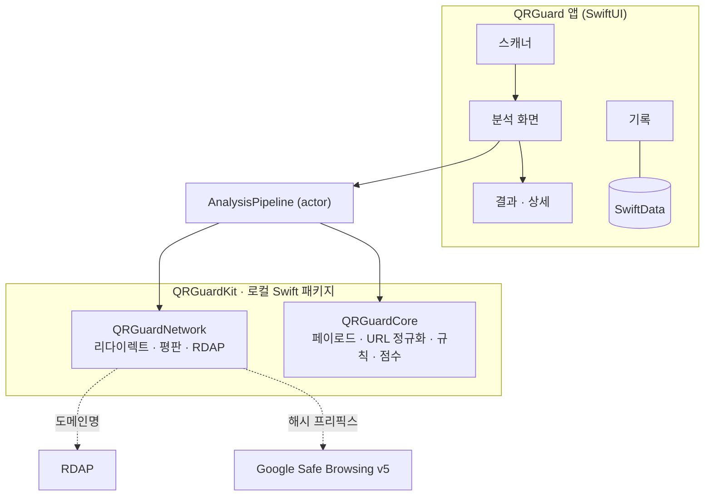

<details>
<summary>분석 시퀀스 · 상태 다이어그램 · 데이터 모델 보기</summary>

| 다이어그램 | 원본 | 이미지 |
|---|---|---|
| 사용자 흐름 | [`user-flow.mmd`](docs/diagrams/user-flow.mmd) | [SVG](docs/diagrams/user-flow.svg) |
| 아키텍처 | [`architecture.mmd`](docs/diagrams/architecture.mmd) | [SVG](docs/diagrams/architecture.svg) |
| 분석 시퀀스 | [`analysis-sequence.mmd`](docs/diagrams/analysis-sequence.mmd) | [SVG](docs/diagrams/analysis-sequence.svg) |
| 분석 상태 | [`analysis-state.mmd`](docs/diagrams/analysis-state.mmd) | [SVG](docs/diagrams/analysis-state.svg) |
| 점수 산정 | [`scoring.mmd`](docs/diagrams/scoring.mmd) | [SVG](docs/diagrams/scoring.svg) |
| 데이터 모델 | [`data-model.mmd`](docs/diagrams/data-model.mmd) | [SVG](docs/diagrams/data-model.svg) |

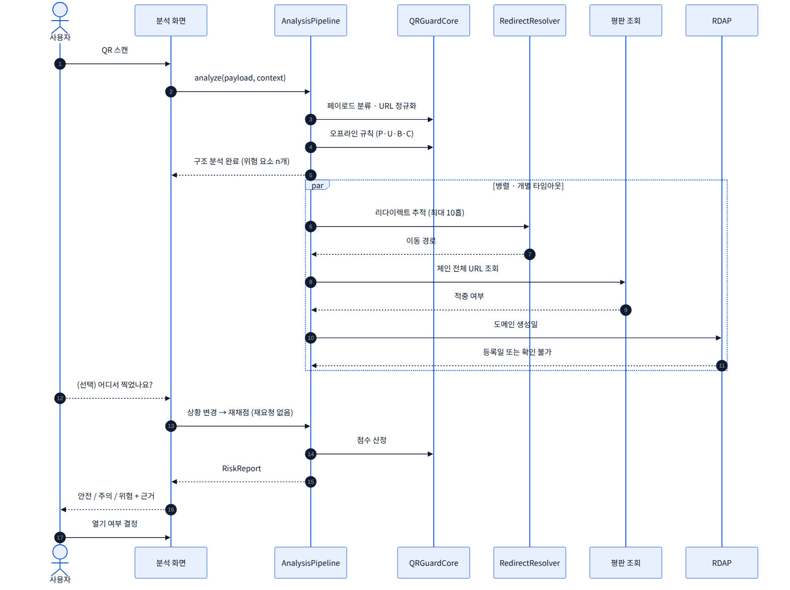

</details>

## 개인정보 원칙

- 계정도, 자체 서버도 없습니다. 스캔 기록은 기기 안에만 저장되며 보관 기간을 고르거나 저장을 끌 수 있습니다.
- 평판 조회는 주소 원문이 아니라 **해시의 앞 4바이트**만 보냅니다.
- 실제 도착 주소 확인은 쿠키·캐시 없이 요청하지만, 상대 서버는 접속 사실을 알 수 있습니다. 그래서 설정에서 끌 수 있고 화면에 그 사실을 설명합니다.
- 앱은 스캔한 주소를 스스로 열거나 웹뷰로 렌더링하지 않습니다.

## 시작하기

### 요구 사항

- macOS + Xcode 27 (iOS 27 SDK). 배포 대상은 iOS 18.0 이상
- iOS 기기 또는 시뮬레이터 (카메라 스캔은 실제 기기 필요 — 시뮬레이터는 샘플 QR 버튼으로 흐름 확인)
- (선택) Google Safe Browsing API 키 — 없으면 실시간 평판 조회만 건너뛰고 번들 블록리스트로 동작합니다

### 빌드 · 실행

```bash
# API 키 설정 (선택) — Secrets.xcconfig는 .gitignore에 포함되어 커밋되지 않습니다
cp Config/Secrets.example.xcconfig Config/Secrets.xcconfig
# Secrets.xcconfig 안의 SAFE_BROWSING_API_KEY 값을 채웁니다 (Base.xcconfig가 #include? 로 읽습니다)
```

- Xcode에서 `Untitled Project.xcodeproj`를 열고(Xcode가 만든 프로젝트 이름이며 타깃은 `MyApp`, 제품 이름은 `QRGuard`) `⌘R`로 실행합니다.
- 분석 엔진·네트워크 테스트는 로컬 패키지에서 돌립니다.

```bash
cd Packages/QRGuardKit && swift test        # Core 124 · Network 66
```

- 분석 화면으로 바로 진입하려면 런치 인자 `-UITestPayload <문자열>`을 씁니다. 예: `-UITestPayload https://example.com/`

### GitHub Desktop으로 저장소 만들기

1. GitHub Desktop에서 **File → Add Local Repository…** 를 누르고 이 폴더를 선택합니다(`git init`은 되어 있고 커밋은 없습니다).
2. 첫 커밋 메시지(예: `QR Guard MVP: engine, network, app`)를 입력하고 **Commit to main** → **Publish repository** 를 누릅니다.

### Xcode의 Claude와 함께 작업하기

저장소 루트의 [`CLAUDE.md`](CLAUDE.md)에 작업 규칙과 문서 읽는 순서를 정리해 두었습니다. Claude에게는 "`CLAUDE.md`를 읽고 `TASKS.md`의 다음 태스크를 진행해 줘"라고 요청하면 됩니다.

## 저장소 구조

```
.
├─ Untitled Project.xcodeproj   # Xcode 프로젝트 (타깃 MyApp → 제품 QRGuard, iOS 18+)
├─ MyApp/                       # 앱 타깃 (SwiftUI, Swift 6, 기본 MainActor 격리)
│  ├─ MyApp.swift               # @main QRGuardApp (SwiftData 컨테이너)
│  ├─ ContentView.swift         # RootView: NavigationStack + AppRoute
│  ├─ App/                      # AppModel · AppSettings · AnalysisSession
│  ├─ DesignSystem/             # Tokens(Palette) · RiskMeter · StatusEmblem · AddressCard · FindingRow …
│  ├─ Features/                 # Onboarding · Home · Scanner · Import · Analysis · Result · Detail · History · Settings · IncidentGuide
│  ├─ Persistence/              # ScanRecord(@Model) · HistoryStore
│  └─ Resources/                # Localizable.xcstrings · PrivacyInfo.xcprivacy
├─ Packages/QRGuardKit/         # 로컬 Swift 패키지 (Swift 6 언어 모드)
│  ├─ Sources/QRGuardCore/      # Payload · URL(Punycode) · Domain(PSL) · Rules(41개) · Scoring · Data(JSON) · Text
│  ├─ Sources/QRGuardNetwork/   # RedirectResolver · SafeBrowsingV5 · URLhaus · RDAP · PagePrecheck · AnalysisPipeline
│  └─ Tests/                    # Core 124 (픽스처 106) · Network 66 (URLProtocol 스텁)
├─ Config/                      # Base.xcconfig (+ Secrets.xcconfig, gitignore)
├─ docs/                        # TECH_PRD · TASKS · RISK_RULES · diagrams · assets(실제 캡처)
├─ CLAUDE.md · README.md · LICENSE · NOTICE
```

## 로드맵

- [x] **Phase 0** 프로젝트 · 패키지 세팅
- [x] **Phase 1** 분석 엔진 (페이로드 · URL · 오프라인 규칙 · 점수)
- [x] **Phase 2** 입력 (스캐너 · 겹친 QR · 사진 · 붙여넣기) — 실기기 겹침 QR 수동 QA 남음
- [x] **Phase 3** 결과 UI (디자인 시스템 · 결과 · 상세)
- [x] **Phase 4** 온라인 검사 (리다이렉트 · Safe Browsing · RDAP · 페이지 사전 검사) — 실제 키로 Safe Browsing 수동 확인 남음
- [x] **Phase 5** 기록 · 설정 · 피해 대응 가이드
- [ ] **Phase 6** 공유 확장 · 제어 센터 컨트롤 · 보안 데이터 업데이트
- [ ] **Phase 7** 접근성 · 성능 · 출시 준비 (영어 번역: 규칙 문구는 완료, 앱 UI 문구는 한국어만)

세부 항목은 [`docs/TASKS.md`](docs/TASKS.md)를 참고하세요.

## 기여

이슈와 PR을 환영합니다. 판정 규칙을 제안할 때는 수법의 공개 근거(기관 발표, 보안 연구 등)를 함께 적어 주세요. 규칙 변경은 `docs/RISK_RULES.md`와 테스트 픽스처를 같은 PR에서 수정합니다.

## 참고 자료

- 한국인터넷진흥원(KISA) 큐싱 공격 경고 — [뉴시스, 2026-01-13](https://www.newsis.com/view/NISX20260112_0003472942)
- 관계부처 합동 큐싱 피해 예방 당부 — [뉴시스, 2024-10-23](https://www.newsis.com/view/NISX20241023_0002931067)
- 큐싱 피해 사례와 예방법(신용보증재단중앙회·경찰청) — [SBS Biz, 2024-02-19](https://biz.sbs.co.kr/amp/article/20000157498)
- KISA 예방수칙 기반 큐싱 실태와 예방법 — [보안뉴스](https://m.boannews.com/html/detail.html?idx=135364)
- FTC 큐싱 소비자 경보 — [WPTV 보도](https://www.wptv.com/scammers-are-using-qr-codes-to-steal-your-information-ftc-warns)
- FTC·FBI 권고 정리 — [ChannelNews](https://www.channelnews.com.au/ftc-warns-about-increased-qr-code-scams/)
- 오픈 리다이렉트를 악용한 큐싱 캠페인 — [Cyber Defense Magazine](https://www.cyberdefensemagazine.com/quishing-campaign-exploits-microsoft-open-redirect-vulnerability/)
- URL 단축기와 피싱 — [CaptainDNS](https://www.captaindns.com/en/blog/url-shorteners-security-risks-phishing-attack-vector)
- 해외 결제 큐싱 사례 — [KB Think](https://kbthink.com/main/living-finance/consumption-life/card-consumption/overseas-payment-fraud.html)
- Google Safe Browsing v5 — [개발자 문서](https://developers.google.com/safe-browsing/reference)

## 면책

QR Guard는 알려진 수법과 공개 위협 정보를 바탕으로 위험 가능성을 알려주는 보조 도구입니다. 모든 악성 사이트를 탐지할 수는 없으며, "안전" 등급도 위험이 없음을 보장하지 않습니다. 접속 후 로그인·결제·앱 설치를 요구하면 다시 한 번 확인하세요.

피해가 의심되면 경찰청 **112**, 금융감독원 **1332**, 한국인터넷진흥원 **118** 로 상담·신고할 수 있습니다.

## 라이선스

[Apache License 2.0](LICENSE). 번들 데이터(Public Suffix List, Unicode confusables)의 라이선스는 [`NOTICE`](NOTICE)를 참고하세요.
