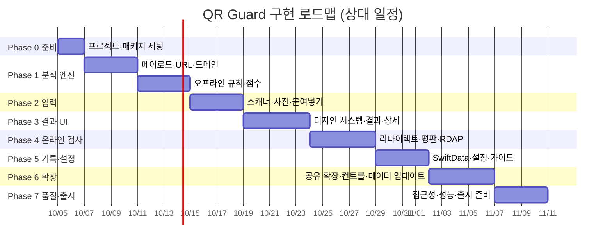

# QR Guard — 작업 목록 (Tasks)

> 문서 버전 1.0 · 2026-10-03
> 사용법: 위에서부터 순서대로 진행한다. 한 번에 **한 태스크**만 작업하고, 수용 기준을 모두 만족하면 체크박스를 `[x]`로 바꾼 뒤 커밋한다.
> 커밋 메시지 형식: `[T-1.3] URLNormalizer: IDN·퍼센트 인코딩 정규화`
> 판정 규칙의 세부 값은 항상 [`RISK_RULES.md`](RISK_RULES.md)를 따른다. UI·아키텍처는 [`TECH_PRD.md`](TECH_PRD.md)를 따른다.

## 진행 순서 한눈에 보기

---

## Phase 0 — 준비

### T-0.1 Xcode 프로젝트 생성 · [P0]
- [x] iOS App 템플릿, 이름 `QRGuard`, 인터페이스 SwiftUI, 저장소 SwiftData, 테스트 Swift Testing
- [x] Deployment Target iOS 18.0, Swift 6 언어 모드, Strict Concurrency = Complete
- [x] `TECH_PRD.md` 5.3절 폴더 구조대로 그룹 생성(빈 파일은 만들지 않음)
- **수용 기준**: 빈 앱이 시뮬레이터에서 실행되고 `⌘U` 테스트가 통과한다.

### T-0.2 로컬 Swift 패키지 `QRGuardKit` · [P0]
- [x] `Packages/QRGuardKit/Package.swift` — 타깃 `QRGuardCore`, `QRGuardNetwork`(→ Core 의존), 테스트 타깃 2개, `resources: [.process("Resources")]`
- [x] 앱 타깃에 두 라이브러리 연결
- **수용 기준**: `swift test`(패키지 폴더)와 Xcode 테스트 모두 통과.

### T-0.3 설정 파일 · [P0]
- [x] `Config/Base.xcconfig`, `Config/Secrets.example.xcconfig`(`SAFE_BROWSING_API_KEY =`), `Secrets.xcconfig`는 gitignore 확인
- [x] Info.plist에 `SafeBrowsingAPIKey = $(SAFE_BROWSING_API_KEY)`, `NSCameraUsageDescription`
- **수용 기준**: 키가 비어 있어도 빌드·실행된다.

---

## Phase 1 — 분석 엔진 (QRGuardCore, UI 없음)

### T-1.1 `QRPayload` 파서 · [P0]
- [x] `PayloadParser.parse(_ raw: String) -> QRPayload` — URL, `WIFI:`, `SMSTO:`/`sms:`, `tel:`, `mailto:`/`MATMSG:`, `BEGIN:VCARD`/`MECARD:`, `geo:`, `bitcoin:`/`ethereum:`, 기타 스킴은 `.appScheme`
- [x] 텍스트 안 URL 추출(`NSDataDetector`)
- **수용 기준**: 페이로드 종류별 테스트 각 2개 이상 통과. 앞뒤 공백·대소문자 스킴 처리.

### T-1.2 Public Suffix List · eTLD+1 · [P0]
- [x] `public_suffix_list.dat` 번들, 와일드카드·예외 규칙 지원 파서
- [x] `RegistrableDomain.from(host:)` — `a.b.example.co.kr` → `example.co.kr`
- **수용 기준**: PSL 공식 테스트 케이스 중 주요 30개 통과. 첫 호출 후 조회 1μs대(사전 인덱싱).

### T-1.3 `URLNormalizer` · [P0]
- [x] 소문자 호스트, 끝 점 제거, 기본 포트 제거, 프래그먼트 분리, 퍼센트 인코딩 비율·이중 인코딩 감지
- [x] Punycode(RFC 3492) 디코더 → 표시용 유니코드 호스트, 문자 체계(Script) 판별
- [x] userinfo(`@`) 분리, IP 리터럴 판별(IPv4 축약형 `0x7f.1` 포함)
- **수용 기준**: `NormalizedURL`이 원본·정규화·표시용 호스트·eTLD+1·플래그를 모두 갖는다. 테스트 20개.

### T-1.4 데이터 파일 · [P0]
- [x] `brands.json`, `shorteners.json`, `suspicious_tlds.json`, `app_schemes.json`, `payment_mobility.json`, `blocklist.json`, `confusables_subset.txt`
- [x] `DataStore` — 번들 데이터 로드, (Phase 6) 업데이트 데이터 우선
- **수용 기준**: 로드 실패 시 앱이 죽지 않고 빈 목록 + 로그. 브랜드 공식 도메인은 출시 전 재검증 TODO 주석.

### T-1.5 오프라인 규칙 P·U·B·C · [P0]
- [x] `RiskRule` 프로토콜, 규칙별 파일(`Rules/P01_DangerousScheme.swift` 등)
- [x] B02: 편집 거리(Damerau-Levenshtein) + confusable skeleton
- [x] U09: 쿼리 값 디코딩 후 URL 판별, 다른 eTLD+1인지 비교
- **수용 기준**: `RISK_RULES.md` 3.1–3.3, 3.8 규칙 전부 구현. 규칙별 양성 2·음성 1 테스트.

### T-1.6 `RiskScorer` · [P0]
- [x] 2장 공식(합산 → floor → 허용목록 조정 → clamp), 카테고리 상한, B03 예외(T01·U09)
- [x] `RiskReport` 생성, findings 점수 내림차순, `passedChecks`
- **수용 기준**: 경계값 29/30·69/70, floor, 상한, 예외 테스트 통과.

### T-1.7 픽스처 회귀 테스트 · [P0]
- [x] `Tests/Fixtures/cases.json` 60건 이상, 파라미터화 테스트로 일괄 실행
- **수용 기준**: 전부 통과. 이후 규칙 변경 시 이 테스트가 기준선.

---

## Phase 2 — 입력 (스캐너 · 사진 · 붙여넣기)

### T-2.1 온보딩 + 카메라 권한 프라이밍 · [P0]
- [x] 첫 실행 1화면: 방패 아이콘, 앱이 하는 일 3줄, "카메라 허용" / "나중에"
- **수용 기준**: 권한 거부 상태에서도 홈의 사진·붙여넣기 기능은 동작, 스캐너 진입 시 설정 이동 안내.

### T-2.2 홈 화면 · [P0]
- [x] 큰 스캔 버튼, 사진에서 불러오기(`PhotosPicker`), 링크 붙여넣기(`PasteButton` + 수동 입력 시트), 최근 기록 3건, 예방 팁 카드(5종 순환)
- **수용 기준**: `docs/assets/screens/01-home.png` 목업과 구조 일치. Dynamic Type AX3에서 레이아웃 유지.

### T-2.3 스캐너 · [P0]
- [x] `DataScannerViewController`(`recognizedDataTypes: [.barcode(symbologies: [.qr])]`, `recognizesMultipleItems: true`) 래핑
- [x] 미지원 기기 → `AVCaptureMetadataOutput` 폴백
- [x] 인식 즉시 일시정지 + 햅틱 → 분석으로 전달, 셔터 버튼 없음
- [x] 서로 다른 페이로드 2개 이상 → 상단 경고 배너 + 어느 코드를 검사할지 선택(`distinctCodesInFrame` 전달)
- [x] 플래시 토글, 사진 불러오기, 주소 직접 입력, 첫 사용 코치마크
- **수용 기준**: 실제 기기에서 인쇄된 QR 2장 겹침 시 경고가 뜬다.

### T-2.4 이미지 QR 디코딩 · [P0]
- [x] Vision `DetectBarcodesRequest`로 사진 속 QR 전부 추출, 0개면 안내 문구
- **수용 기준**: `CIQRCodeGenerator`로 만든 단일·이중 QR 이미지 테스트 통과.

---

## Phase 3 — 결과 UI

### T-3.1 디자인 시스템 · [P0]
- [x] `Tokens.swift`(색 Light/Dark, 간격, 모서리), `RiskTier` → 색·아이콘·라벨·햅틱 매핑
- [x] 컴포넌트: `RiskMeter`(+미니), `StatusEmblem`, `AddressCard`(eTLD+1 굵게), `FindingRow`, `PrimaryActionButton`, `TipCard`
- **수용 기준**: 각 컴포넌트 `#Preview` 3등급 × Light/Dark. 색만으로 등급을 구분하지 않는다.

### T-3.2 분석 중 화면 · [P0]
- [x] `AnalysisPipeline` 이벤트 구독 → 단계 목록(구조 분석 / 실제 주소 확인 / 도메인 정보 / 악성 사이트 조회) 상태 아이콘
- [x] "어디서 찍었나요?" 칩(선택 시 재채점), 취소, 최소 표시 0.6초
- [x] Phase 4 전까지는 온라인 단계를 `.skipped`로 표시
- **수용 기준**: 오프라인 상태에서 결과 화면까지 도달, `coverage = .offlineOnly` 배지.

### T-3.3 결과 화면 · [P0]
- [x] 단일 `ResultView`가 등급별 스타일·문구·행동 버튼(TECH_PRD 7.5) 전환
- [x] 상위 위험 요소 3개, 리다이렉트 시 "스캔한 주소 → 실제 도착 주소"
- [x] 주의 체크리스트 시트, 위험 2단계 열기(확인 대화상자 + 2초 길게 누르기), 차단 시 열기 버튼 없음
- [x] 주소 복사, 공유, "이미 열었다면?" 링크
- **수용 기준**: UI 테스트로 4가지 상태의 버튼 구성을 검증. `docs/assets/screens/04~06` 목업과 구조 일치.

### T-3.4 상세 분석 화면 · [P0]
- [x] 섹션: 발견된 위험 요소(펼침: 이유·권장 행동·근거 기관) / 통과한 검사(접힘) / 리다이렉트 경로 타임라인 / 도메인 정보(IDN 원문·퓨니코드·생성일) / 확인 범위 / 원본 데이터(복사)
- **수용 기준**: VoiceOver로 모든 항목을 읽을 수 있다.

---

## Phase 4 — 온라인 검사 (QRGuardNetwork)

### T-4.1 `RedirectResolver` · [P0]
- [x] ephemeral 세션, 리다이렉트 델리게이트에서 `nil` 반환 후 수동 추적, 최대 10홉, 홉당 3초·전체 6초
- [x] HEAD 실패 시 `GET` + `Range: bytes=0-0`, 루프 감지, 사설 IP·`.local` 차단, `http://` 홉은 접속하지 않고 종료
- **수용 기준**: `URLProtocol` 스텁으로 301/302/303/307/308, 루프, 11홉, HTTPS→HTTP, 타임아웃 테스트 통과.

### T-4.2 R 규칙 · [P0]
- [x] R01–R04 구현, R05(meta refresh)는 T-4.6과 함께
- **수용 기준**: `RISK_RULES.md` 3.4 테스트 통과.

### T-4.3 Safe Browsing v5 Provider · [P0]
- [x] URL 정규화·표현식 생성(Safe Browsing 명세), SHA-256, 4바이트 프리픽스 조회, 전체 해시 비교
- [x] 키 없음·쿼터 초과·오류 → Provider 비활성 + `coverage = .partial`
- **수용 기준**: 명세 예제 정규화 케이스 테스트, 스텁 응답 적중/비적중 테스트. 실제 키로 Google 테스트 URL 확인(수동).

### T-4.4 로컬 블록리스트 + T01 · [P0]
- [x] `blocklist.json`(eTLD+1·호스트·URL 접두사) 조회, 체인 전체 URL 대상
- **수용 기준**: 처음·중간·최종 어느 위치 적중이든 floor 90.

### T-4.5 RDAP · D 규칙 · [P1]
- [x] `https://rdap.org/domain/{eTLD+1}` → `events[eventAction == "registration"]`, 실패 시 D03
- **수용 기준**: 스텁 응답으로 D01/D02/D03 테스트.

### T-4.6 페이지 사전 검사 · H 규칙 · [P1]
- [x] 설정 켜짐일 때만, 256KB 상한 스트리밍 수신, 정규식 기반 경량 파싱(password input, form action, title, meta refresh)
- [x] Content-Type이 앱 패키지면 P03/P04로 승격, TLS 실패는 H05
- **수용 기준**: HTML 픽스처 10종 테스트.

### T-4.7 `AnalysisPipeline` 통합 · [P0]
- [x] actor, `AsyncStream<AnalysisEvent>`, `withTaskGroup` 병렬 + 개별 타임아웃, 장소 칩 변경 시 재채점(네트워크 재요청 없이)
- **수용 기준**: 네트워크 차단 상태·느린 네트워크(Network Link Conditioner 3G)에서도 6초 안에 결과.

### T-4.8 URLhaus Provider · [P2]
- [x] 설정 기본 꺼짐, Auth-Key 필요 여부 확인 후 구현, URL 원문 전송 고지
- **수용 기준**: 꺼져 있으면 어떤 요청도 보내지 않는다.

---

## Phase 5 — 기록 · 설정 · 가이드

### T-5.1 SwiftData 기록 · [P0]
- [x] `ScanRecord`/`FindingRecord`/`RedirectHopRecord`(TECH_PRD 5.5), 저장·조회·삭제, 보관 기간 만료 정리
- **수용 기준**: "저장 안 함"이면 디스크에 쓰지 않는다.

### T-5.2 기록 화면 · [P0]
- [x] 필터(전체/안전/주의/위험), 검색, 스와이프 삭제, 전체 삭제 확인, 미니 RiskMeter, "열었음" 표시, 빈 상태
- [x] 행 탭 → 저장된 `RiskReport`로 결과 화면, "다시 검사" 버튼
- **수용 기준**: 초안의 배지 텍스트 잘림이 재현되지 않는다(AX5 포함).

### T-5.3 설정 화면 · [P0]
- [x] 일반(테마·진동·사운드), 검사 항목(토글 + 전송 내용 설명, TECH_PRD 6.1), 기록(보관 기간), 보안 데이터(자동 업데이트·마지막 업데이트), 도움(피해 대응 가이드·신고처), 정보(오픈소스 라이선스·개인정보 처리방침·앱 정보)
- **수용 기준**: 토글 변경이 다음 분석부터 즉시 반영.

### T-5.4 피해 대응 가이드 · [P0]
- [x] TECH_PRD 7.7 내용, `tel:` 버튼(112·1332·118), 위험 등급을 연 기록이 있으면 홈 상단 배너로 진입 유도
- **수용 기준**: 시뮬레이터에서 전화 버튼이 `tel:` URL을 연다(실기기 확인).

---

## Phase 6 — 확장

### T-6.1 공유 확장 · [P1]
- [ ] 이미지·URL·텍스트 수신 → `QRGuardKit`으로 분석 → 확장 안 결과 요약(등급·위험 점수·상위 요소) + "QR Guard에서 열기"
- [ ] App Group으로 기록 공유
- **수용 기준**: 사진 앱·Safari·메일에서 공유 시트로 동작, 메모리 한도(120MB) 내.

### T-6.2 App Intent · 제어 센터 컨트롤 · 잠금화면 위젯 · [P2]
- [ ] `OpenScannerIntent`, `ControlWidgetButton`, 잠금화면 원형 위젯
- **수용 기준**: 제어 센터에서 한 번 탭으로 스캐너가 열린다.

### T-6.3 보안 데이터 원격 업데이트 · [P1]
- [ ] 정적 호스팅(GitHub Releases 등)의 JSON + Ed25519 서명 검증(`CryptoKit`), 하루 1회, 실패 시 번들 데이터
- **수용 기준**: 서명 불일치 데이터는 적용하지 않는다.

### T-6.4 국내 피싱 URL 데이터 병합 · [P2]
- [ ] KISA 공공데이터 피싱 사이트 URL 데이터셋의 형식·이용 조건 확인 → 변환 스크립트 → `blocklist.json` 병합
- **수용 기준**: 출처·갱신일이 데이터 파일 메타에 기록된다.

---

## Phase 7 — 품질 · 출시

### T-7.1 접근성 점검 · [P0]
- [ ] VoiceOver 순서, Dynamic Type AX5, 대비(Accessibility Inspector), Reduce Motion
### T-7.2 성능 · [P0]
- [ ] Instruments로 오프라인 분석 p95 < 100ms, 스캐너 진입 < 500ms 확인
### T-7.3 현지화 · [P1]
- [ ] 영어 String Catalog 번역, 하드코딩 문자열 0개
### T-7.4 출시 준비 · [P0]
- [ ] `PrivacyInfo.xcprivacy`, 오픈소스 라이선스 화면(PSL MPL-2.0, Unicode), Safe Browsing 고지
- [ ] 시뮬레이터 실제 캡처로 `docs/assets/screens/` 교체, README 갱신
- [ ] TestFlight 내부 테스트

---

## 진행 기록

| 날짜 | 태스크 | 메모 |
|---|---|---|
| 2026-10-04 | T-0.1~0.3 | Xcode가 만든 `Untitled Project.xcodeproj`/타깃 `MyApp`을 그대로 쓰고 제품 이름만 `QRGuard`로 설정(iOS 전용, 18.0+, Swift 6, 기본 MainActor 격리). 로컬 패키지 `Packages/QRGuardKit`와 `Config/Base.xcconfig`는 pbxproj를 직접 편집해 연결(Xcode 빌드 설정 도구가 pbxproj를 재저장하면서 외부에서 넣은 패키지 참조를 지울 수 있어 설정 변경을 먼저, 패키지 참조를 마지막에 넣음). |
| 2026-10-04 | T-1.1~1.7 | QRGuardCore: 파서·PSL(공식 테스트 76건)·Punycode·정규화·데이터 JSON 7종·규칙 41개(P/U/B/C + R/T/D/H도 순수 함수로 Core에 둠)·Scorer·픽스처 106건, Localizable.xcstrings(ko/en 175키). 보수적 결정: B02 편집 거리는 4글자 브랜드엔 1, U07 비율은 ASCII 인코딩만 계산, T01은 로컬 블록리스트로 오프라인에서도 발동. |
| 2026-10-04 | T-2.1~2.4 | DataScanner(지원 기기) → AVCaptureMetadataOutput 폴백, 시뮬레이터는 샘플 버튼. 겹친 QR은 선택 전까지 자동 선택하지 않음. 사진은 Vision `DetectBarcodesRequest`. 실기기 인쇄 QR 2장 겹침 QA는 미실시. |
| 2026-10-04 | T-3.1~3.4 | RiskMeter(0→점수 1회 애니메이션, Reduce Motion 시 생략), 등급은 색+아이콘 모양+텍스트. 위험 등급 열기 = 알림창 → 2초 길게 누르기 시트. 장소 칩은 스냅샷 재채점(네트워크 재요청 없음). |
| 2026-10-04 | T-4.1~4.8 | QRGuardNetwork: 리다이렉트는 델리게이트 nil + 수동 추적, http 홉·사설 IP 미접속, Safe Browsing v5 hashes:search(정규화 예제 38건), RDAP, 256KB 페이지 검사, 파이프라인 TaskGroup+개별 타임아웃. coverage: 사용자가 켠 검사 중 실패·불가 항목만 partial. 실제 키로 Google 테스트 URL 확인은 미실시(키 없음). |
| 2026-10-04 | T-5.1~5.4 | SwiftData `ScanRecord`에 RiskReport/AnalysisSnapshot JSON과 검색용 컬럼 저장(FindingRecord/RedirectHopRecord 관계 대신 JSON 내장 — 단순화). 위험 등급을 연 기록이 있으면 홈 배너. 시뮬레이터 2회 전체 검증(9단계 통과, 크래시 1건 수정: UIColor 동적 공급 클로저의 MainActor 격리). |
