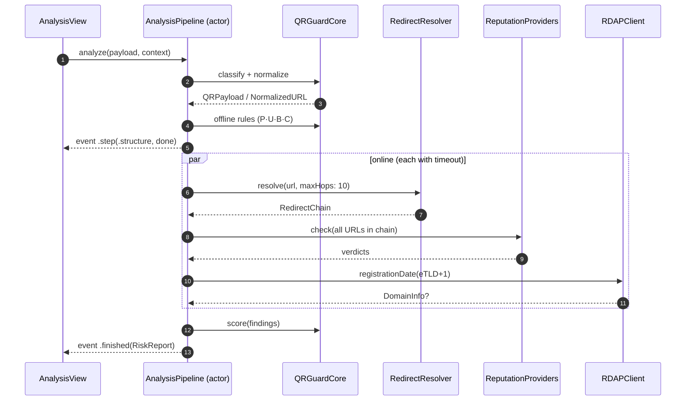
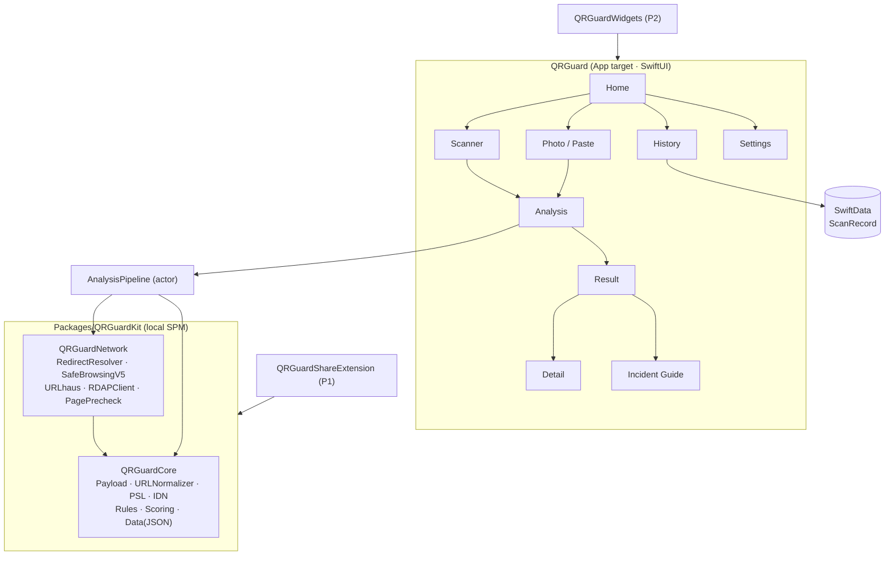
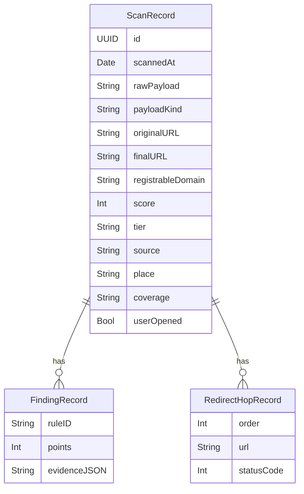
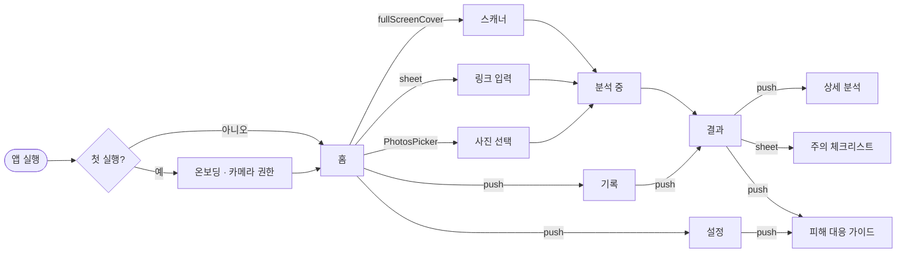

# QR Guard — Tech PRD

> 문서 버전 1.0 · 2026-10-03
> 대상 독자: Xcode에서 이 저장소를 구현하는 Claude와 사람 개발자
> 함께 읽을 문서: [`RISK_RULES.md`](RISK_RULES.md)(판정 규칙의 단일 진실 공급원) · [`TASKS.md`](TASKS.md)(작업 순서) · [`../CLAUDE.md`](../CLAUDE.md)(작업 규칙)

---

## 1. 개요

**QR Guard**는 QR 코드를 스캔하면 바로 접속하지 않고, 먼저 위험 요소를 분석해 **안전 / 주의 / 위험** 세 단계로 알려주는 iOS 앱이다. 사용자는 분석 결과를 보고 접속 여부를 직접 결정한다.

```
QR 스캔 → 위험 요소 분석 → 결과 표시 → 사용자가 접속 여부 결정
```

### 1.1 문제 정의

- 사람 눈으로는 QR 코드가 어디로 연결되는지 알 수 없다. 기본 카메라 앱은 주소를 짧게 보여준 뒤 바로 열 수 있게 한다.
- 국내외 기관이 반복해서 경고한 큐싱(Quishing) 수법은 크게 다섯 가지다(근거는 `RISK_RULES.md` 7장).
  1. **물리적 덧붙이기** — 공유 킥보드·주차 미터기의 정상 QR 위에 가짜 스티커를 붙인다. (S2, S5)
  2. **사칭 메일·문자 속 QR** — 대출 안내, 계정 문제, 택배 재배송, 기관·연구원 자문 요청을 핑계로 QR을 찍게 한다. (S1, S3, S5)
  3. **악성 앱 설치 유도** — "보안 앱", "안전거래 앱"이라며 설치 파일로 보낸다. (S1, S2, S3)
  4. **가짜 로그인 페이지** — 정상 사이트와 비슷한 주소·화면으로 계정 정보를 받는다. (S1, S3, S6)
  5. **탐지 회피** — 단축 URL, 오픈 리다이렉트 연쇄, 한 글자 바꾼 도메인으로 실제 목적지를 숨긴다. (S3, S7, S10)
- 메일 보안 솔루션은 이미지 속 QR을 잘 검사하지 못하고, 피싱 사이트는 수명이 짧아 평판 DB만으로는 늦다(S8). 따라서 **기기에서 즉시 돌아가는 구조 분석 + 실시간 평판 조회**를 함께 써야 한다.

### 1.2 원안 대비 보완점 (근거 기반)

| # | 보완 내용 | 막는 수법 | 근거 |
|---|---|---|---|
| 1 | **최종 목적지 추적**: 단축 URL·리다이렉트 체인을 쿠키 없이 끝까지 따라가 실제 도착 주소를 보여줌 | 단축 URL, 오픈 리다이렉트 | S7, S10 |
| 2 | **브랜드 사칭·유사 도메인 탐지**: 국내 주요 브랜드 공식 도메인 목록 + 편집 거리 + 유니코드 혼동 문자 검사 | 한 글자 바꾼 주소, 키릴 문자 위장 | S3, S5 |
| 3 | **iOS 특화 위험 페이로드 차단**: `itms-services:`(기업용 앱 설치), `.mobileconfig`(구성 프로파일), `javascript:`/`data:` | 악성 앱·프로파일 설치 | S1, S2, S3 |
| 4 | **겹친 QR 감지**: 한 화면에 서로 다른 QR이 2개 이상이면 스티커 덧붙임 의심 경고 | 물리적 덧붙이기 | S2, S5 |
| 5 | **스캔 상황 입력**: "어디서 찍었나요?"(주차·결제 / 킥보드 / 메일·문자 / 가게) 선택 시 맥락 규칙 적용 | 메일·문자 QR 인증 요구, 결제 QR 바꿔치기 | S4, S5, S9 |
| 6 | **페이지 사전 검사(선택)**: HTML 앞부분만 정적으로 받아 비밀번호 입력란·외부 전송 폼·브랜드 위장 탐지 | 가짜 로그인 페이지 | S1, S6 |
| 7 | **도메인 나이**: RDAP로 생성일 조회, 신생 도메인 가중 | 단명 피싱 사이트 | S8 |
| 8 | **"안전" 단정 금지 + 확인 범위 표시**: 점수가 낮아도 "알려진 위험이 없음"으로 표현, 오프라인 분석만 했으면 배지 | 과신으로 인한 2차 피해 | S8 |
| 9 | **주의 등급 체크리스트**: 열기 전 "로그인·결제·앱 설치를 요구하면 즉시 닫기" 확인 시트 | 접속 후 정보 입력 | S3, S6 |
| 10 | **피해 대응 가이드 + 신고 연계**: 이미 열었을 때의 조치, 118·112·1332 전화, 보호나라 큐싱 확인 서비스 안내 | 2차 피해 | S1, S3 |
| 11 | **화면 속 QR 검사**: 공유 확장(Share Extension)과 사진 불러오기로 메일·메신저 이미지 속 QR 검사 | 메일·메신저 큐싱 | S1, S3 |

### 1.3 목표 / 비목표

**목표 (MVP)**
- 카메라·사진·붙여넣기로 받은 QR/URL을 5초 안에(네트워크 양호 기준) 분석하고 등급과 근거를 보여준다.
- 오프라인에서도 구조·사칭·페이로드 분석이 동작한다.
- 자체 서버 없이 동작한다. 스캔 기록은 기기에만 저장한다.

**비목표**
- 웹페이지의 자바스크립트를 실행하는 동적 분석(샌드박스 브라우저)
- 악성 앱 탐지·백신 기능
- Android 버전, 자체 위협 DB 서버 운영(Phase 3 이후 검토)

---

## 2. 사용자 & 시나리오

| 페르소나 | 상황 | 기대 |
|---|---|---|
| 직장인 (30대) | 회사 메일로 "보안 인증 갱신" QR 수신 | 메일 속 QR을 캡처해 불러오면 위험 여부와 이유를 확인 |
| 대학생 (20대) | 공유 킥보드 대여 QR 스캔 | 덧붙인 스티커·낯선 결제 도메인을 경고 |
| 자영업자 (50대) | "소상공인 저금리 대출" 우편물 QR | 앱 설치 링크면 강하게 차단 |
| 부모님 (60대) | 주차장 정산 QR | 큰 글씨, 단순한 3단계 결과, 신고 전화 버튼 |

---

## 3. 기능 요구사항

우선순위: **P0** = MVP 필수, **P1** = 1차 업데이트, **P2** = 이후.

| ID | 기능 | 우선순위 | 수용 기준 |
|---|---|---|---|
| F-01 | 카메라 QR 스캔 (자동 인식, 셔터 없음) | P0 | 인식 즉시 스캔 일시정지 + 햅틱, 분석 화면으로 전환. 기본 카메라 앱처럼 바로 열지 않음 |
| F-02 | 다중 QR 감지 경고 | P0 | 프레임/사진에서 서로 다른 내용 QR ≥2 → C01 규칙 + 선택 시트 |
| F-03 | 사진에서 불러오기 | P0 | `PhotosPicker`(권한 불필요) → Vision 바코드 감지 |
| F-04 | 링크·텍스트 붙여넣기 검사 | P0 | `PasteButton` 사용(붙여넣기 권한 팝업 회피), 수동 입력 지원 |
| F-05 | 페이로드 분류 | P0 | URL, Wi-Fi, SMS, 전화, 메일, 연락처, 위치, 앱 스킴, 결제, 텍스트 |
| F-06 | 오프라인 분석 (P/U/B/C 규칙) | P0 | 100ms 이내, 네트워크 없이 동작 |
| F-07 | 리다이렉트 추적 (R 규칙) | P0 | 최대 10홉, 홉당 3초, 전체 6초, 쿠키·캐시 없음 |
| F-08 | 평판 조회 (T01) | P0 | Google Safe Browsing v5 해시 프리픽스 조회(URL 원문 미전송) + 번들 블록리스트 |
| F-09 | 도메인 나이 (D 규칙) | P1 | RDAP 조회, 실패 시 D03 |
| F-10 | 페이지 사전 검사 (H 규칙) | P1 | 설정 토글, 기본 꺼짐. 256KB까지 HTML 정적 파싱 |
| F-11 | 결과 화면 (3등급 + 차단) | P0 | 등급별 행동 버튼 규칙(6.5절) 준수, 상위 위험 요소 3개 요약 |
| F-12 | 상세 분석 화면 | P0 | 위험 요소·통과 항목·리다이렉트 경로·도메인 정보·확인 범위·원본 데이터 |
| F-13 | 스캔 상황 선택 칩 | P1 | 분석 중 화면에서 선택, 선택 즉시 재채점 |
| F-14 | 기록 | P0 | SwiftData, 필터·검색·스와이프 삭제·전체 삭제, 저장 끄기 옵션 |
| F-15 | 설정 | P0 | 검사 항목 토글(개인정보 설명 포함), 기록 보관 기간, 테마, 햅틱, 사운드 |
| F-16 | 피해 대응 가이드 | P0 | 체크리스트 + `tel:` 버튼(118, 112, 1332) |
| F-17 | 공유 확장 | P1 | 사진/URL/텍스트를 공유 시트로 받아 분석 결과를 확장 안에서 표시 |
| F-18 | 제어 센터 컨트롤 · 잠금화면 위젯 · App Intent | P2 | "QR Guard로 스캔" 한 번에 스캐너 진입 |
| F-19 | 보안 데이터 업데이트 | P1 | 블록리스트·단축기·TLD·브랜드 목록 JSON 원격 갱신(서명 검증), 실패 시 번들 데이터 사용 |
| F-20 | 첫 실행 안내 + 카메라 권한 프라이밍 | P0 | 한 화면, 앱이 하는 일 3줄 + "카메라 허용" |

---

## 4. 분석 파이프라인



- `AnalysisPipeline.analyze(_:context:)`는 `AsyncStream<AnalysisEvent>`를 반환한다. 분석 중 화면의 단계 목록은 이 이벤트로만 갱신한다(가짜 진행 표시 금지).
- 온라인 단계는 `withTaskGroup`으로 병렬 실행하되 각 작업에 개별 타임아웃을 둔다. 타임아웃은 실패가 아니라 `coverage = .partial`로 처리한다.
- 설정에서 온라인 검사를 끄면 오프라인 단계만 수행하고 `coverage = .offlineOnly`.

---

## 5. 기술 스택 & 아키텍처

### 5.1 스택

| 항목 | 선택 | 이유 |
|---|---|---|
| IDE | Xcode 26 | Claude 연동 코딩 환경 |
| 최소 지원 | iOS 18.0 | Vision Swift API(`DetectBarcodesRequest`), Control Widget(F-18), SwiftData 안정화 |
| 언어 | Swift 6 (strict concurrency) | 파이프라인이 actor·TaskGroup 중심 |
| UI | SwiftUI + Observation(`@Observable`) | |
| 스캐너 | VisionKit `DataScannerViewController`(지원 기기) → 미지원 시 AVFoundation `AVCaptureMetadataOutput` 폴백 | 다중 코드 동시 인식, 하이라이트 |
| 이미지 QR | Vision `DetectBarcodesRequest` (`.qr`) | 사진·공유 확장 |
| 저장 | SwiftData (`ScanRecord`) + Data Protection `completeUntilFirstUserAuthentication` | |
| 네트워크 | `URLSession(configuration: .ephemeral)` + `URLSessionTaskDelegate` 리다이렉트 가로채기 | 쿠키·캐시 미보존 |
| 도메인 파싱 | Public Suffix List 번들(`public_suffix_list.dat`, MPL-2.0) | eTLD+1 계산 |
| IDN | Punycode(RFC 3492) 디코더 자체 구현 + UTS #39 confusables 부분집합 번들 | 유사 문자 탐지 |
| 외부 의존성 | **없음**(MVP). 추가 시 `CLAUDE.md` 규칙에 따라 사전 합의 | 공급망 위험 최소화 |
| 로컬라이즈 | String Catalog(`Localizable.xcstrings`), 한국어 기본 + 영어 | |
| 테스트 | Swift Testing(`@Test`) + XCUITest | |

### 5.2 모듈 구조



- `QRGuardCore`는 UIKit/SwiftUI를 import하지 않는다(맥 테스트·확장 재사용).
- `QRGuardNetwork`는 프로토콜 뒤에 숨기고 테스트에서는 `URLProtocol` 스텁으로 대체한다.

### 5.3 폴더 구조

```
QRGuard/
├─ QRGuard.xcodeproj
├─ QRGuard/                      # App target
│  ├─ App/                       # QRGuardApp, AppRouter, DependencyContainer
│  ├─ Features/
│  │  ├─ Onboarding/  Home/  Scanner/  Analysis/
│  │  ├─ Result/  Detail/  History/  Settings/  IncidentGuide/
│  ├─ DesignSystem/              # Tokens.swift, RiskMeter, StatusBadge, ActionButton …
│  ├─ Persistence/               # ScanRecord(@Model), HistoryStore
│  └─ Resources/                 # Assets.xcassets, Localizable.xcstrings, PrivacyInfo.xcprivacy
├─ Packages/QRGuardKit/
│  ├─ Package.swift
│  ├─ Sources/QRGuardCore/
│  │  ├─ Payload/  URL/  Domain/  Rules/  Scoring/
│  │  └─ Resources/  brands.json shorteners.json suspicious_tlds.json
│  │                 app_schemes.json payment_mobility.json blocklist.json
│  │                 public_suffix_list.dat confusables_subset.txt
│  ├─ Sources/QRGuardNetwork/
│  └─ Tests/  QRGuardCoreTests/  QRGuardNetworkTests/  Fixtures/cases.json
├─ QRGuardShareExtension/        # P1
├─ QRGuardWidgets/               # P2
├─ Config/  Base.xcconfig  Secrets.example.xcconfig
└─ docs/
```

### 5.4 핵심 타입 (계약)

```swift
// QRGuardCore
public enum QRPayload: Sendable, Hashable {
    case url(URL)
    case wifi(WiFiConfig)                 // WIFI:T:WPA;S:ssid;P:pass;H:false;;
    case sms(number: String, body: String?)
    case phone(String)
    case email(address: String, subject: String?, body: String?)
    case contact(raw: String)             // vCard / MECARD
    case geo(latitude: Double, longitude: Double)
    case appScheme(URL)                   // kakaotalk://, itms-services:// …
    case payment(PaymentPayload)          // bitcoin:, 계좌 패턴
    case text(String, embeddedURLs: [URL])
}

public enum ScanSource: String, Codable, Sendable { case camera, photo, paste, shareExtension }
public enum PlaceContext: String, Codable, Sendable, CaseIterable {
    case parkingOrPayment, mobility, emailOrMessage, storeOrMenu, other
}

public struct AnalysisContext: Sendable {
    public var source: ScanSource
    public var place: PlaceContext?          // 사용자가 선택한 경우만
    public var distinctCodesInFrame: Int     // C01
    public var options: AnalysisOptions      // 설정 토글 스냅샷
}

public protocol RiskRule: Sendable {
    var id: RuleID { get }
    var stage: RuleStage { get }             // .offline / .online
    func evaluate(_ input: RuleInput) -> RiskFinding?
}

public struct RiskScorer: Sendable {
    public func score(_ findings: [RiskFinding], coverage: AnalysisCoverage) -> RiskReport
}

// QRGuardNetwork
public protocol RedirectResolving: Sendable {
    func resolve(_ url: URL, maxHops: Int, perHopTimeout: Duration) async -> RedirectChain
}
public protocol ReputationProvider: Sendable {
    var name: String { get }
    func lookup(_ urls: [URL]) async throws -> [URL: ReputationVerdict]
}
public protocol DomainInfoProviding: Sendable {
    func registrationDate(for registrableDomain: String) async throws -> Date?
}

// App
public enum AnalysisEvent: Sendable {
    case stepStarted(AnalysisStep)
    case stepFinished(AnalysisStep, StepOutcome)   // .passed / .flagged(count) / .skipped / .timedOut
    case finished(RiskReport)
}
```

### 5.5 데이터 모델 (SwiftData)



- 보관 기간 설정(7일 / 30일 / 무기한 / 저장 안 함). 앱 시작 시 만료 레코드 삭제.
- `userOpened`는 사용자가 결과 화면에서 실제로 열었는지 기록 → 기록 화면에서 "열었음" 표시, 위험 등급인데 열었으면 피해 대응 가이드 배너 노출.

---

## 6. 네트워크·외부 서비스·개인정보

### 6.1 무엇이 어디로 전송되는가

| 검사 | 전송 대상 | 전송 내용 | 기본값 | 설정 화면 설명 문구 |
|---|---|---|---|---|
| 리다이렉트 추적 | 스캔한 주소의 서버 | HEAD/GET 요청(쿠키 없음) | 켜짐 | 실제 도착 주소를 확인하려고 해당 사이트에 접속해요. 상대 서버는 누군가 접속했다는 사실을 알 수 있어요. |
| 평판 조회 | Google Safe Browsing | URL 해시의 앞 4바이트(원문 아님) | 켜짐 | 주소 원문이 아닌 짧은 암호화 조각만 보내 악성 여부를 확인해요. |
| URLhaus 조회 | abuse.ch | URL 원문 | 꺼짐 | 주소 원문을 보내 악성 파일 배포지인지 확인해요. |
| 도메인 정보 | RDAP(rdap.org 경유) | 도메인 이름 | 켜짐 | 도메인이 언제 만들어졌는지 확인해요. |
| 페이지 사전 검사 | 최종 주소의 서버 | GET 1회(256KB, 쿠키 없음, JS 미실행) | 꺼짐 | 페이지 앞부분만 받아 로그인 입력란 등을 미리 확인해요. |

### 6.2 구현 규칙

- 모든 요청은 `URLSessionConfiguration.ephemeral`, `httpShouldSetCookies = false`, `urlCache = nil`, 사용자 에이전트는 모바일 Safari와 동일하게(클로킹 회피) 설정한다.
- 리다이렉트는 `urlSession(_:task:willPerformHTTPRedirection:newRequest:)`에서 **항상 `nil`을 반환**해 직접 한 홉씩 따라간다(각 홉 기록·검사 목적).
- HEAD가 405/403이면 `GET` + `Range: bytes=0-0`으로 재시도.
- **ATS**: `NSAllowsArbitraryLoads`를 켜지 않는다. `http://` 홉은 접속하지 않고 U01/R03으로 기록한 뒤 "HTTP 구간 이후는 확인하지 않음" 상태로 종료 → `coverage = .partial`.
- 사설 IP·`localhost`·`.local`로 향하는 홉은 요청하지 않는다(로컬 네트워크 기기 노출 방지).
- **Google Safe Browsing v5**: `hashes.search`(해시 프리픽스 조회) 방식. URL 정규화·표현식 생성은 Safe Browsing 명세를 따르고, 정확한 엔드포인트·파라미터는 구현 시점의 공식 문서로 확인한다. **API는 비상업적 용도에 한정**되므로 유료화 계획이 생기면 상용 대체재(예: Web Risk API)로 교체한다.
- API 키는 `Config/Secrets.xcconfig`(gitignore) → `Info.plist` 빌드 변수로 주입한다. 키가 없으면 해당 Provider를 비활성화하고 `coverage = .partial`.
- 국내 데이터: KISA가 공공데이터로 제공하는 피싱 사이트 URL 데이터셋의 제공 형식·이용 조건을 확인한 뒤 번들 블록리스트에 병합하는 작업을 P2로 둔다(확인 필요).

### 6.3 개인정보

- 계정·로그인 없음. 자체 서버 없음. 분석 기록은 기기에만 저장.
- `PrivacyInfo.xcprivacy` 작성: 수집 데이터 없음, Required Reason API(`UserDefaults` 등) 사유 기재.
- 카메라 권한 문구: "QR 코드를 스캔해 연결된 주소의 위험 요소를 확인하는 데 카메라를 사용해요."

---

## 7. UI/UX 명세

### 7.1 레퍼런스(초안) 분석과 재구성 방향

첨부 초안(`docs/assets/reference/ui-draft.png`)의 시각 언어(파란 방패 아이콘, 흰 카드, 등급별 컬러 원형 아이콘)를 유지하고, 사용 흐름과 판단 정확도를 높이는 방향으로 재구성한다.

| 화면 | 초안에서 유지 | 재구성 (UX 근거) |
|---|---|---|
| 스플래시 | 방패 + QR 아이콘 | 별도 스플래시 화면 제거, Launch Screen만 사용. 첫 실행에만 온보딩 1장(권한 프라이밍) |
| 홈 | 큰 "QR 코드 스캔하기" 버튼, 사진 불러오기, 최근 기록, 팁 카드 | "링크 붙여넣기" 추가(`PasteButton`), 최근 기록 3건을 홈에 바로 노출, 팁 카드는 근거 기반 예방 팁 5종 순환 |
| 스캐너 | 사각 가이드, 플래시, 갤러리, 닫기 | **셔터 버튼 제거** — QR은 자동 인식이 표준이고 셔터는 "사진 찍기"로 오해됨. 대신 하단에 "주소 직접 입력". 다중 QR 감지 시 상단 경고 배너. 첫 사용 시 "스티커가 덧붙여져 있지 않은지 확인하세요" 코치마크 |
| 분석 중 | 원형 진행 + 단계 목록 | 단계 목록은 실제 이벤트로만 갱신. "어디서 찍었나요?" 선택 칩 추가(선택 사항). 취소 버튼. 0.6초 미만으로 끝나도 최소 표시 시간 유지(화면 깜빡임 방지) |
| 결과 (3종) | 등급별 색 원형 아이콘, 점수, 실제 주소 카드, 상세 보기 | ① 점수를 **"위험 점수"** 로 명시하고 0–29 / 30–69 / 70–100 구간이 보이는 **RiskMeter** 추가(초안의 "12/100"이 안전 점수로 오해될 수 있음). ② 실제 주소 카드에서 **등록 도메인(eTLD+1)을 굵게** 강조, 리다이렉트가 있으면 "스캔한 주소 → 실제 도착 주소" 두 줄. ③ 상위 위험 요소 3개를 결과 화면에 바로 요약. ④ 행동 버튼 규칙 재정의(7.5절). ⑤ 색만으로 등급을 구분하지 않도록 아이콘 모양도 다르게(방패 체크 / 삼각형 느낌표 / 팔각형 X) |
| 상세 분석 | 위험 요소 목록과 가산점, 도메인 정보 | 각 요소를 펼치면 "왜 위험한가 · 어떻게 해야 하나 · 근거 기관" 표시. **리다이렉트 경로 타임라인**, **확인 범위**(오프라인/온라인 항목별 상태), 원본 QR 데이터 섹션 추가. 통과 항목은 접어서 표시 |
| 기록 | 전체/안전/주의/위험 필터, 휴지통 | 초안의 배지 텍스트 잘림("의", "전") 문제 → 아이콘 배지 + VoiceOver 라벨로 교체. 검색, 스와이프 삭제, 미니 RiskMeter, "열었음" 표시 |
| 설정 | 테마, 진동, 사운드, 보안 데이터 업데이트, 라이선스·개인정보·서비스 소개 | **검사 항목 섹션** 추가(각 토글 아래 전송 내용 설명), 기록 보관 기간, "도움이 필요할 때"(피해 대응 가이드, 신고처) |
| (신규) 피해 대응 가이드 | — | 이미 열었거나 정보를 입력했을 때 단계별 체크리스트 + 전화 버튼 |

### 7.2 내비게이션



- 루트는 `NavigationStack` + 경로 열거형 `AppRoute`. 스캐너는 `fullScreenCover`.
- 결과 화면에서 "닫기"는 스캐너가 아니라 홈으로 돌아간다(연속 스캔은 결과 화면의 "다른 코드 스캔" 보조 버튼).

### 7.3 디자인 토큰

| 토큰 | Light | Dark | 용도 |
|---|---|---|---|
| `brand` | `#1D5BD8` | `#5B8CFF` | 주요 버튼, 링크, 방패 아이콘 |
| `ink` | `#0F1B33` | `#EEF2FA` | 본문 텍스트 |
| `inkSecondary` | `#5B6478` | `#A3ACBF` | 보조 텍스트 |
| `surface` | `#F3F5F9` | `#0E1320` | 화면 배경 |
| `card` | `#FFFFFF` | `#182033` | 카드 |
| `line` | `#E3E7EF` | `#273049` | 구분선 |
| `safe` / `safeBg` | `#12925A` / `#E7F6EE` | `#3DD68C` / `#0F2A1F` | 안전 |
| `caution` / `cautionBg` | `#B76A00` / `#FFF3DC` | `#FFB547` / `#2E2410` | 주의 (텍스트는 대비 4.5:1 이상인 진한 주황) |
| `danger` / `dangerBg` | `#D92D20` / `#FDECEA` | `#FF6B5E` / `#33161A` | 위험 |

- 글꼴: 시스템 글꼴(SF Pro / Apple SD Gothic Neo), Dynamic Type 텍스트 스타일만 사용. 점수 숫자는 `.system(.largeTitle, design: .rounded).weight(.bold)` + `monospacedDigit()`.
- 모서리: 히어로 카드 22pt, 일반 카드 16pt, 버튼 14pt, 목록 행 12pt — 위계에 따라 다르게.
- 간격: 4pt 그리드(4/8/12/16/24/32).
- 색은 등급 상태 표시에만 쓰고, 행동 버튼은 브랜드 블루(안전) / 중립(주의) / 위험 레드(위험 등급의 "닫기")로 제한한다.

### 7.4 시그니처 컴포넌트: `RiskMeter`

- 가로 막대를 세 구간(0–29 녹색, 30–69 주황, 70–100 빨강)으로 나누고, 현재 점수 위치에 마커를 둔다. 큰 숫자 + "위험 점수" 라벨과 함께 쓴다.
- 결과 진입 시 마커가 0에서 점수 위치로 한 번만 움직인다(0.5초, `accessibilityReduceMotion`이면 생략).
- 기록 행에는 높이 4pt 미니 버전.
- VoiceOver: "위험 점수 82점, 100점 만점, 위험 구간".

### 7.5 결과 화면 행동 규칙

| 등급 | 주 버튼 | 보조 | 열기 경로 |
|---|---|---|---|
| 안전 | **사이트 열기** (brand) | 상세 분석 보기 · 주소 복사 | 바로 Safari로 열기 |
| 주의 | **확인하고 열기** (중립 진한 버튼) | 상세 분석 보기 · 열지 않기 | 체크리스트 시트("로그인·결제·앱 설치를 요구하면 즉시 닫기" 등 3항목) 확인 → 열기 |
| 위험 | **열지 않고 닫기** (danger) | 상세 분석 보기 · 신고하기 | 맨 아래 텍스트 버튼 "위험을 감수하고 열기" → 확인 대화상자 + 2초 길게 누르기 |
| 차단 | **닫기** | 원본 복사 · 신고하기 | 열기 버튼 없음 |

- 실제로 연 경우 `ScanRecord.userOpened = true`.
- 모든 결과 화면 하단에 "이미 열었다면?" 링크 → 피해 대응 가이드.

### 7.6 문구 원칙

- 단정 금지: "안전합니다" 대신 "알려진 위험 요소가 발견되지 않았어요".
- 등급 라벨은 짧게: 안전 · 주의 · 위험.
- 위험 요소 제목은 사용자가 아는 말로(`RISK_RULES.md`의 사용자 문구). 기술 용어는 상세 화면에서만.
- 오류는 무엇이 안 됐고 어떻게 하면 되는지 말한다. 예: "인터넷에 연결되지 않아 구조 분석만 했어요. 연결되면 다시 확인할 수 있어요."

### 7.7 피해 대응 가이드 내용

1. 열린 페이지를 닫고, 입력한 정보가 있다면 해당 서비스 비밀번호를 공식 앱에서 바로 변경
2. 앱이나 프로파일을 설치했다면 삭제: 설정 → 일반 → VPN 및 기기 관리에서 모르는 프로파일 제거
3. 금융 정보를 입력했다면 카드사·은행에 즉시 연락, 결제 내역 확인, 공동·금융인증서 재발급(S1)
4. 신고·상담: 경찰청 112 · 금융감독원 1332 · 한국인터넷진흥원 118 (`tel:` 버튼). 의심 QR은 보호나라 카카오톡 채널의 큐싱 확인 서비스로 확인·신고(S1)

### 7.8 접근성

- 모든 등급 표시는 색 + 아이콘 모양 + 텍스트 3중 표현.
- Dynamic Type 최대(AX5)에서 결과 화면 버튼이 잘리지 않을 것(스크롤 허용).
- VoiceOver 순서: 등급 → 위험 점수 → 실제 주소 → 주 버튼.
- 햅틱: 안전 `.success`, 주의 `.warning`, 위험 `.error`(설정에서 끌 수 있음).

---

## 8. 비기능 요구사항

| 항목 | 기준 |
|---|---|
| 성능 | 오프라인 분석 p95 < 100ms, 전체 분석 p95 < 6s(온라인 포함), 스캐너 진입 < 500ms |
| 안정성 | 네트워크 실패·타임아웃이 크래시나 무한 대기로 이어지지 않음. 어떤 경우에도 결과 화면 도달 |
| 보안 | 앱이 스캔 URL을 자동으로 열거나 WebView로 렌더링하지 않음. API 키는 저장소에 커밋 금지 |
| 개인정보 | 6장 준수. 기록 저장 끄기 시 메모리에서만 처리 |
| 접근성 | 7.8절 |
| 현지화 | ko(기본), en. 하드코딩 문자열 금지 |

## 9. 테스트 전략

- **규칙 단위 테스트**: 규칙마다 양성/음성 케이스, `Fixtures/cases.json` 60개 이상(`RISK_RULES.md` 6장).
- **점수 경계 테스트**: 29/30, 69/70, floor·카테고리 상한·B03 예외.
- **네트워크 테스트**: `URLProtocol` 스텁으로 301/302/307/308 체인, 루프, 10홉 초과, HTTPS→HTTP, 타임아웃.
- **QR 이미지 테스트**: Core Image `CIQRCodeGenerator`로 테스트 QR 생성 → Vision 디코딩, 한 이미지에 QR 2개 합성(C01).
- **UI 테스트**: 스캔 대신 `-UITestPayload <url>` 런치 인자로 분석 화면 진입 → 등급별 버튼 규칙 검증.
- **수동 QA**: 실제 기기에서 킥보드형 스티커 겹침(인쇄물 2장), 저조도, 반사.

## 10. 출시 체크리스트

- [ ] `PrivacyInfo.xcprivacy`, 카메라 권한 문구
- [ ] Safe Browsing 이용 조건(비상업) 재확인, 앱 소개에 "Google Safe Browsing 사용" 고지
- [ ] `NOTICE`에 PSL(MPL-2.0)·Unicode 데이터 라이선스 표기, 앱 내 "오픈소스 라이선스" 화면 동일 내용
- [ ] 브랜드 공식 도메인 목록 재검증
- [ ] App Store 스크린샷을 시뮬레이터 실제 캡처로 교체(README 목업 교체)

## 11. 리스크 & 열린 질문

| 리스크 | 대응 |
|---|---|
| 리다이렉트 추적 요청 자체가 공격자에게 "스캔했다"는 신호가 됨 | 설정에서 끌 수 있게 하고 설명 문구로 고지 |
| 클로킹(봇에게는 정상 페이지 표시) | 모바일 Safari UA 사용, 그래도 한계가 있음을 상세 화면 "확인 범위"에 표기 |
| 오탐으로 정상 결제 QR이 "주의" | `payment_mobility.json` 허용 목록 확대, 기록 화면에서 "잘못된 판정 신고"(P2, 메일 작성) |
| Safe Browsing 비상업 조건 | 수익화 시 Web Risk 등 상용 API로 전환 |
| `.kr` 도메인 RDAP 응답 불확실 | D03으로 처리, KISA WHOIS API 연동은 P2에서 검토 |
